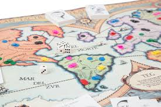

# Mini TEG
Ejemplo de clase con listas, en base al TEG. Variedad de usos del findall.



```
continente(america,[argentina,chile,uruguay,peru,brasil,colombia]).
continente(africa,[sahara,egipto,etiopia,sudafrica,zaire,madagascar]).
continente(europa,[espania,francia,granbretania,islandia,suecia,rusia,alemania,polonia,italia]).

esUnJugador(rojo).
esUnJugador(verde).
esUnJugador(azul).

ocupa(argentina,azul,3).
ocupa(brasil,azul,3).
ocupa(peru,azul,2).
ocupa(colombia,rojo,1).
ocupa(uruguay,rojo,3).
ocupa(chile,verde,8).
ocupa(sahara,azul,3).
ocupa(sudafrica,azul,13).
```

Se quiere averiguar:

* Lista de los paises que ocupa cualquier jugador
* Lista de países ocupados en los que hay más de cuatro fichas
* Lista de jugadores que ocupan países.
* Lista de las cantidades de fichas que hay en los países ocupados por cualquier jugador
* Cantidad total de fichas que hay en los países ocupados por cada jugador
* Cantidad de fichas que tiene cada jugador en cada continente
